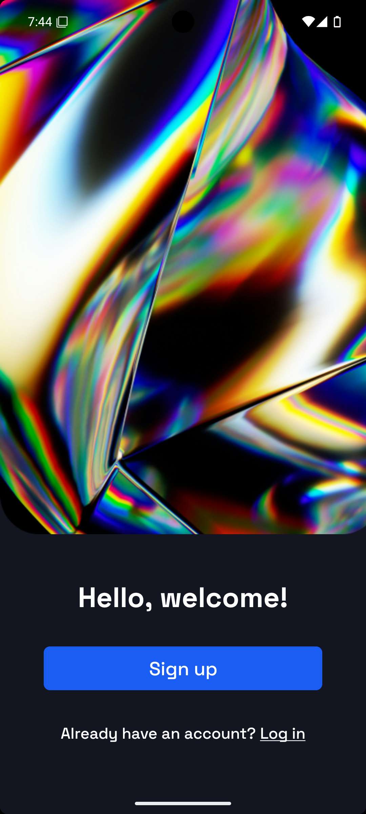
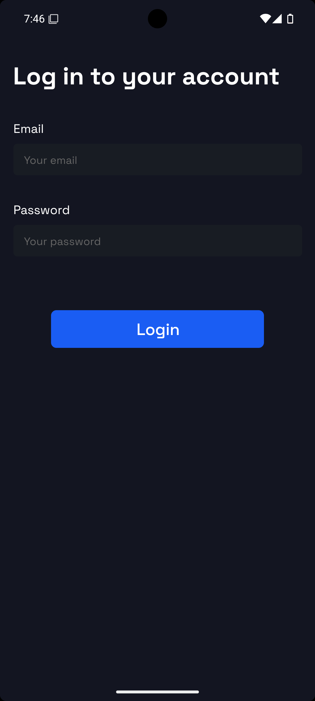
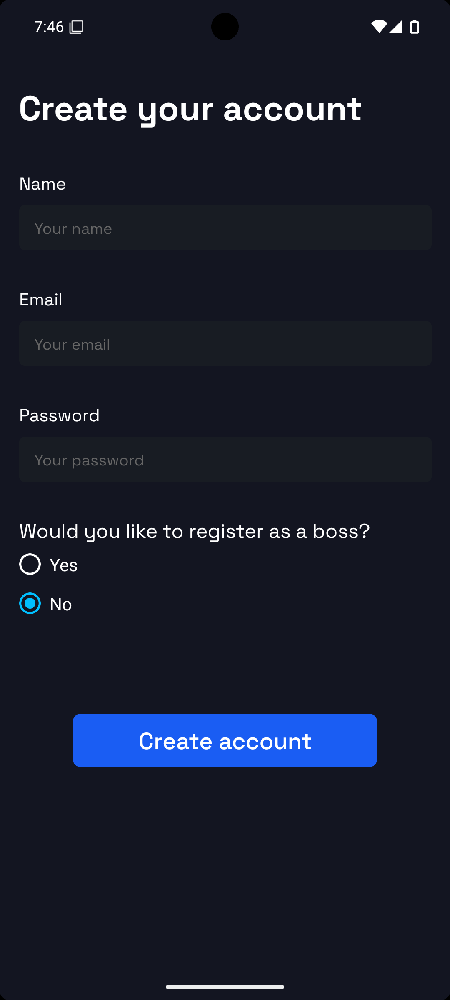

  

 

> 📘 Info
>
> The new version of this application is currently under development. It will feature a redesigned interface, backend integration (built with Kotlin and Ktor), authentication, and more. To access the previous version, please visit the ["old-project" branch](https://github.com/LucasWithBoots/pontoQR/tree/old-project).

 

# Screenshots

  
   
  

