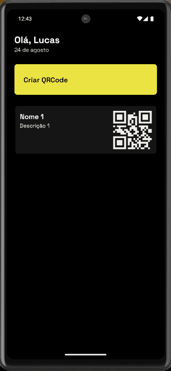

# pontoQR

PontoQR é uma aplicação mobile desenvolvida com o objetivo de gerar e visualizar QR Codes personalizados. Utilizando tecnologias modernas, como React Native, TypeScript, e Tailwind CSS, esta aplicação permite a criação rápida e intuitiva de QR Codes diretamente pelo dispositivo móvel.

## Funcionalidades

- Criação de QR Codes: Interface intuitiva para criar QR Codes personalizados com informações específicas.
- Visualização de QR Codes Criados: Após a criação, visualize o QR Code diretamente na aplicação.
- Persistência de Dados: Utiliza o Context API para gerenciar o estado do QR Code criado.
